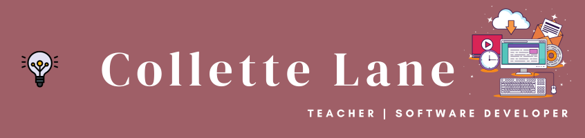

### Hi there 👋

### About Me
✨My name is Collette Lane and I am a student with Get Coding; I enrolled in 2023. I successfully completed my first project, Teacher Gratitude Planner, using HTML, CSS & Javascript.
This project allowed teachers to use a personalized calendar to keep track of special events and their to do list; focus on their personal growth through using a reflective journal and core values list; saved them time with a local storage substitute plan and gave them some resources during the tough times. If you would like to check it out, follow this link https://colletteap.github.io/gratitude-planner/. I am also working on a second project that helps job hunters track and celebrate their progress.

🌱 I’m learning next: React.js 
⚡ Fun fact: I enjoy wood burning & engraving

<!--
**colletteap/colletteap** is a ✨ _special_ ✨ repository because its `README.md` (this file) appears on your GitHub profile.

Here are some ideas to get you started:

- 🔭 I’m currently working on ...
- 🌱 I’m currently learning ...
- 👯 I’m looking to collaborate on ...
- 🤔 I’m looking for help with ...
- 💬 Ask me about ...
- 📫 How to reach me: ...
- 😄 Pronouns: ...
- ⚡ Fun fact: ...
-->
